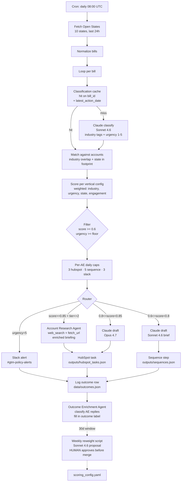

# Policy Signal Engine

Statehouse activity, converted into routed pipeline.

The system pulls live bills from the Open States API, classifies them with Claude, scores each bill against an account book under vertical-specific weights, applies per-AE daily caps to keep volume realistic, and routes outputs to mock CRM tasks, mock outbound sequences, and Slack alerts. Two agents extend the engine: one researches top-tier matches before the AE sees them, one closes the feedback loop by classifying replies. A weekly script proposes a single weight adjustment for human review.

The repo ships with a real run committed under `outputs/`. Open `outputs/run_summary.json` to see the actual counts.

## Three docs

| Doc | Purpose |
|---|---|
| [`docs/STRATEGY.md`](docs/STRATEGY.md) | Positioning, ICP, signal hypothesis, falsifiable bets, metrics framework, rollout plan, risk register |
| [`docs/MOTION.md`](docs/MOTION.md) | The downstream GTM motion the system feeds: per-lane talk tracks, discovery questions, ROI model, land-and-expand, renewal levers |
| [`docs/ENGINEERING.md`](docs/ENGINEERING.md) | Stack, repo layout, how the score works, the two agents, robustness layer, cost breakdown, run commands |

## Where the system fits in the motion

The system covers the top of the funnel for the Enterprise tier of a state policy intelligence product: multi-state operators, field sales motion, AE plus sales engineer plus executive sponsor. It routes a qualified, contextual reason to reach out into an AE's queue at the moment a prospect's compliance team is engaged with the bill.

The structured pitch the system creates, the per-lane talk tracks the AE uses on the first call, the ROI model for the second meeting, and the land-and-expand path that follows are documented in [`docs/MOTION.md`](docs/MOTION.md). The system is the first touch, not the close. The AE owns the conversation throughout.

## Result, in pipeline terms

| Step | Rate | Daily output |
|---|---|---|
| Routed actions per day | · | 55 |
| AE accepts and sends (matches the leading metric target in STRATEGY.md: > 60%) | 60% | 33 |
| Reply rate on signal-triggered outbound | 10% | 3.3 |
| Meeting booked from reply | 30% | 1 |
| Qualified opp from meeting | 30% | 0.3 |
| Median Enterprise ACV | $50,000 | **$15,000 in pipeline created per day** |

Annualized: ~$3.75M of sourced pipeline per year across a 5-AE book, ~$750K per AE per year. System cost per day at this scope: $0.65 in Claude API spend, dropping to under $0.20 per day in steady state with the classification cache active. Break-even is one qualified opportunity per quarter; the operating ratio is roughly 23,000 dollars of pipeline created per dollar of API spend.

These are projection rates, not measured outcomes. The metric the system is actually judged on is the leading metric in `docs/STRATEGY.md`: AE acceptance rate above 60%. Bills classified, matches scored, and other engineering counts are inputs to that number, not substitutes for it.

## Architecture

## What this run produced

From `outputs/run_summary.json`:

- 92 bills fetched across 10 states (CA, TX, FL, NY, PA, IL, OH, GA, NC, MI), 30-day window
- 92 classified by Claude into industry tags (controlled vocabulary), urgency 1-5, topic summary, and affected entity types
- 383 (bill, account) pairs above the 0.6 score threshold and at or above each vertical's urgency floor
- Per-AE caps applied (3 hubspot, 5 sequence, 3 slack), trimming to 55 routed actions across 5 AEs
  - 15 Slack alerts on urgency-5 bills (most are GA bills signed into law: HB 1015 self-insurers fund, SB 162 medical credentialing, HB 1329 controlled substances, HB 117 seafood labeling, SB 452 401(k) cap)
  - 15 HubSpot tasks for top-tier matches (score >= 0.8, account tier <= 2)
  - 25 sequence steps for the bulk tier
- 5 top-tier matches enriched by the Account Research Agent
- 22 mock AE replies classified and applied to `data/outcomes.json` by the Outcome Enrichment Agent
- Estimated Claude cost: $0.65 for the full run

A reviewer can open `outputs/hubspot_tasks.json` and see fully drafted, account-specific briefings, not stub text. Engineering detail and the run command set live in [`docs/ENGINEERING.md`](docs/ENGINEERING.md).

## What to build next

Documented in `docs/STRATEGY.md` ("Risk register" and "What this is not"). Three live items:

1. Real HubSpot Engagements API integration (replace the JSON write with a real POST + association to the Account record, keep the JSON write as a debug log)
2. Pendo or product-usage signal stream alongside policy activity (a bill on auto insurance is a stronger signal if Pendo also shows the AE's contact at the account visited the rate-modeling docs that week)
3. Statistical reweight handoff once N > 500 outcomes per vertical (logistic regression replaces the LLM proposal; human approval step stays)

## Notes

- The classifications and briefings under `outputs/` were produced during the build by a Claude pass with the same models the script uses. To reproduce against fresh Open States data, set `OPENSTATES_API_KEY` and `ANTHROPIC_API_KEY` and run `scripts/run_pipeline.py`.
- The `accounts.json` file is mock: 60 large public companies across six verticals with realistic state footprints. The bills are real.
- Slack alerts in `outputs/slack_alerts.json` are formatted for an incoming webhook but no webhook was called during the build run. Set `SLACK_WEBHOOK_URL` and uncomment the call site to enable.
- The Account Research Agent's tool layer is stubbed in this repo for portability; the agent loop and prompt are production-shape. Swap `web_search` and `fetch_url` for real implementations to go live.
- The reweight proposal in `outputs/reweight_proposal.json` was produced from the seeded `data/sample_outcomes.json`. The script's `--dry-run` reproduces the exact proposal; live mode against fresh outcomes data calls Claude.
