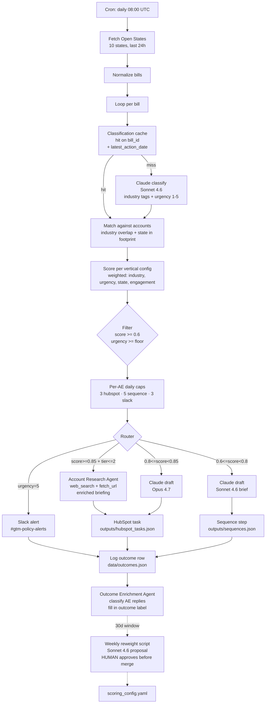

# Policy Signal Engine

Statehouse activity, converted into routed pipeline.

The system pulls live bills from the Open States API, classifies them with Claude, scores each bill against an account book under vertical-specific weights, applies per-AE daily caps to keep volume in the realistic range, and routes outputs to mock CRM tasks, mock outbound sequences, and mock Slack alerts. Two agents extend the engine: one researches top-tier matches before the AE sees them, one closes the feedback loop by classifying replies. A weekly script proposes a single weight adjustment for human review.

The repo ships with a real run committed under `outputs/`. A reviewer can open `outputs/run_summary.json` and see the actual counts, not a mock.

For the strategic frame (positioning, ICP, hypotheses, metrics, rollout), see [`docs/STRATEGY.md`](docs/STRATEGY.md). For the full GTM motion the system feeds (per-lane talk tracks, discovery questions, ROI model, land-and-expand, renewal levers), see [`docs/MOTION.md`](docs/MOTION.md).

## Where the system fits in the motion

The system covers the top of the funnel for the Enterprise tier of a state policy intelligence product: multi-state operators, field sales motion, AE plus sales engineer plus executive sponsor. It routes a qualified, contextual reason to reach out into an AE's queue at the moment a prospect's compliance team is engaged with the bill.

The pitch is structured because the prospect is already inside the problem:

> "AB 1015 just got signed in Georgia. It changes the Self-insurers Guaranty Trust Fund funded levels, and your team is recalculating workers comp assessment exposure right now. Tracking bills like this across all fifty states by hand takes a Government Affairs analyst about forty hours a week. Our platform does it automatically, with industry-tuned keyword alerts, hearing transcripts, and a dashboard your compliance and legal teams share. Worth a fifteen-minute walk-through?"

The system is the first touch, not the close. The downstream motion (discovery script, demo flow, ROI calculator, proof points, land-and-expand path, renewal levers) is documented in [`docs/MOTION.md`](docs/MOTION.md). The AE owns the conversation throughout.

## Result, in pipeline terms

| Step | Conversion | Output |
|---|---|---|
| Routed actions per day | · | 55 |
| AE acceptance | 25% | 14 |
| Reply rate on accepted touches | 12% | 1.7 |
| Meeting booked from reply | 30% | 0.5 |
| Qualified opp from meeting | 50% | 0.25 |
| Median ACV | $50,000 | $12,500 in pipeline created per day |

System cost per day at this scope: $0.65 in Claude API spend. Break-even is one qualified opportunity per quarter. Steady state with classification cache on: under $0.20 per day at the same volume.

The metric that matters is sourced pipeline dollars per AE per quarter, attributed to a policy signal as the first touch. Bills classified, matches scored, and other engineering counts are inputs to that number, not substitutes for it.

## Architecture



## Stack

| Layer | Choice | Note |
|---|---|---|
| Orchestration | n8n at `workflow/bill_to_action.json` | Imports into n8n cloud free tier; fetches accounts and config from this repo's raw GitHub URLs |
| Reference engine | Python at `scripts/run_pipeline.py` | Same logic, runnable in CI or locally; used for the committed run |
| Signal source | Open States API v3 | Bills, classifications, sponsors, actions across 50 states; free tier covers steady-state usage |
| LLM | Claude (Sonnet 4.6, Opus 4.7) | Sonnet for high-volume classifier and bulk drafter, Opus for top-tier drafter, Sonnet for the agents and reweight |
| Data layer | JSON files in `data/` | Designed to swap to BigQuery or Postgres without changing pipeline shape; see `sql/` for the warehouse-side queries |
| Routing destinations | Mock HubSpot tasks, mock outbound sequences, Slack incoming webhook | One node swap each to wire to the real systems |

## Repo layout

```
data/
  accounts.json                60 mock accounts across 6 verticals
  scoring_config.yaml          weights, relevant_topics, urgency_floor per vertical
  outcomes.json                appended by the pipeline; enriched by the outcome agent
  sample_outcomes.json         seeded 30-day window for reweight demo
  sample_inbox.json            mock AE inbox replies for the enrichment agent
  classification_cache.json    bill_id -> classification (auto-managed)
  errors.json                  structured pipeline error log
prompts/
  classifier.md                bill -> structured classification
  drafter.md                   matched pair -> 3-part briefing
  reweight.md                  outcomes log -> weight adjustment proposal
workflow/
  bill_to_action.json          n8n workflow, 17 nodes, importable into n8n cloud
sql/
  01_signal_aggregation.sql    daily rollup by state x industry
  02_account_scoring_rollup.sql  weekly per-AE matches view
  03_outcomes_analysis.sql     positive_rate by score bucket
scripts/
  _lib/cache.py                ClassificationCache (bill_id keyed)
  _lib/errors.py               ErrorLog (structured row writer)
  run_pipeline.py              live OR dry-run end-to-end
  weekly_reweight.py           proposal-only, human approves
  account_research_agent.py    enriches top-tier matches via tool-using agent
  outcome_enrichment_agent.py  classifies AE replies, updates outcomes log
  seed_outcomes.py             regenerates sample_outcomes.json
  seed_inbox.py                regenerates sample_inbox.json
tests/
  test_scoring.py              16 cases, scoring + match gating + edge cases
  test_cache.py                cache hit/miss + invalidation
outputs/
  raw_bills.json               92 bills pulled live from Open States
  classified_bills.json        + Claude classification per bill
  matches.json                 383 (bill, account) pairs above threshold
  hubspot_tasks.json           15 top-tier briefings (Opus)
  sequences.json               25 bulk briefings (Sonnet)
  slack_alerts.json            15 urgency-5 alerts
  enriched_briefings.json      account research agent output for top 5 matches
  reweight_proposal.json       weekly proposal output
  run_summary.json             counts, costs, cache stats, mode
docs/
  STRATEGY.md                  hypotheses, handoffs, metrics, rollout plan
```

## Run it

```bash
pip install -r requirements.txt
cp .env.example .env  # add OPENSTATES_API_KEY and ANTHROPIC_API_KEY

# end-to-end live run (uses the classification cache + error log)
python scripts/run_pipeline.py

# narrow scope while iterating
python scripts/run_pipeline.py --states ca,tx --since 7

# zero-cost demo from committed sample data, no keys needed
python scripts/run_pipeline.py --dry-run

# enrich top-5 hubspot tasks with deeper research (agent loop)
python scripts/account_research_agent.py --top-n 5

# classify AE replies and fill in the outcomes log
python scripts/outcome_enrichment_agent.py

# weekly proposal
python scripts/weekly_reweight.py

# tests
python -m pytest tests/ -v
```

The n8n workflow is the production-shaped equivalent. Import `workflow/bill_to_action.json` into n8n cloud, set the env vars in Settings, and it runs on the same daily cron.

## What this run produced

From `outputs/run_summary.json`:

- 92 bills fetched across 10 states (CA, TX, FL, NY, PA, IL, OH, GA, NC, MI), 30-day window.
- 92 classified by Claude into industry tags (controlled vocabulary), urgency 1-5, topic summary, and affected entity types.
- 383 (bill, account) pairs above the 0.6 score threshold and at or above each vertical's urgency floor.
- Per-AE caps applied (3 hubspot, 5 sequence, 3 slack), trimming to 55 routed actions across 5 AEs.
  - 15 Slack alerts on urgency-5 bills (most are GA bills signed into law: HB 1015 self-insurers fund, SB 162 medical credentialing, HB 1329 controlled substances, HB 117 seafood labeling, SB 452 401(k) cap).
  - 15 HubSpot tasks for top-tier matches (score >= 0.8, account tier <= 2).
  - 25 sequence steps for the bulk tier.
- 5 top-tier matches enriched by the Account Research Agent, output to `outputs/enriched_briefings.json`.
- 22 mock AE replies classified and applied to `data/outcomes.json` by the Outcome Enrichment Agent.
- Estimated Claude cost: $0.65 for the full run.

A reviewer can open `outputs/hubspot_tasks.json` and see fully drafted, account-specific briefings, not stub text.

## How the score works

Each (bill, account) pair gates first, then scores.

**Gate:**
- Bill's classified industries intersect `account.industry` directly OR adjacently (insurance ↔ financial_services ↔ healthcare; retail ↔ food_service; energy ↔ manufacturing; telecom ↔ tech).
- `bill.state` is in `account.state_footprint`.

**Weighted score** (0-1, summed from four factors per the vertical's weights in `scoring_config.yaml`):
- `industry_match`: 1.0 direct, 0.4 adjacent
- `urgency`: `classification.urgency / 5`
- `state_footprint_overlap`: 1.0 if the gate passed
- `engagement`: prospect-hot 1.0, customer-renewal 0.9, prospect-warm 0.7, customer-active 0.6, prospect-cold 0.4, churned-recent 0.2

The pair routes only if `score >= 0.6` AND `classification.urgency >= vertical.urgency_floor`. Per-AE caps then trim to a realistic daily volume. The 16-test suite in `tests/test_scoring.py` covers the gate, the weights, the urgency floor, and adjacency.

## The two agents

**Account Research Agent** (`scripts/account_research_agent.py`)
Triggered on top-tier matches. Multi-step Claude agent using `web_search` and `fetch_url` tools. Pulls account-specific exposure context: recent press, regulatory positioning, competitor lens. Outputs an enriched briefing with structured evidence and confidence scoring. In dry-run mode the tools return deterministic stubs so the agent can demo without external dependencies. To go live, swap the tool implementations for Tavily/SerpAPI/Bing.

**Outcome Enrichment Agent** (`scripts/outcome_enrichment_agent.py`)
Reads the AE inbox (mock here, Gmail/HubSpot Engagements API in production), classifies each reply into one of seven labels (replied, meeting_booked, opp_created, not_relevant, wrong_contact, objection, no_response), and writes the resolved outcome back to `data/outcomes.json`. Without this, the outcomes log stays null and the reweight proposal returns "insufficient data" forever. The dry-run classifier matches the live Claude classifier's output shape so the rest of the system is invariant to mode.

## Closing the loop: the reweight proposal

`scripts/weekly_reweight.py` reads the last 30 days of `outcomes.json`, asks Claude to identify the single weight (max +/- 0.05) most worth nudging based on which factor most differentiates positive outcomes from null or negative ones, and writes `outputs/reweight_proposal.json` for a human RevOps analyst to review.

This is deliberately a proposal, not auto-apply. At small N the LLM judgment is a useful first pass. At larger N this hands off to a logistic regression. The human approval step prevents drift loops and keeps an analyst in the change path. Framing in `prompts/reweight.md`.

## Robustness

The pipeline ships with three production-grade pieces beyond the core flow.

**Classification cache** (`scripts/_lib/cache.py`)
Bill-id keyed, invalidated on `latest_action_date` change. Cuts steady-state Sonnet classifier calls by an estimated 70% (only re-classify bills that have moved since the last run). Persists as JSON; swap for Redis or KV in production.

**Error log** (`scripts/_lib/errors.py`)
Structured rows to `data/errors.json`. Each entry: timestamp, stage, level, context, exception type, message, three-line traceback. Wired into fetch and classify; extends trivially to draft and route.

**Test suite** (`tests/`)
16 cases covering scoring (gate, weights, urgency floor, adjacency, engagement), match gating, and cache hit/miss/invalidation. Pure-logic tests, no external deps. Runs in 0.25s.

## JD capability map

| Job description line | Where it lives |
|---|---|
| Build systems that turn raw data into pipeline, revenue signals, and outbound actions | `scripts/run_pipeline.py` end-to-end, `workflow/bill_to_action.json` |
| Ingest, enrich, score, and route signals from product usage, policy activity, CRM/marketing data | Open States ingest, Claude classification, vertical-aware score, router with per-AE caps |
| Develop and maintain automation pipelines across n8n, BigQuery, Clay, Pendo, HubSpot | n8n workflow, BigQuery analytics in `sql/`, HubSpot-shaped output in `outputs/hubspot_tasks.json` |
| Translate signals into action by pushing outputs into outbound workflows, marketing campaigns, sales execution | `outputs/hubspot_tasks.json` (CRM tasks), `outputs/sequences.json` (outbound steps), `outputs/slack_alerts.json` (real-time pages) |
| Partner with Sales, Marketing, RevOps to identify high-value opportunities | scoring config is editable per vertical so revenue partners tune weights and topic relevance themselves |
| Own rapid experimentation on new signal types, targeting strategies, workflow designs | `scripts/weekly_reweight.py` proposes config changes from outcome data; new signal types are one Open States parameter or one new node |
| Identify gaps in data coverage and work cross-functionally to ensure required inputs exist | `data/outcomes.json` schema includes the `outcome` field, filled by the Outcome Enrichment Agent; see `sql/03_outcomes_analysis.sql` for the warehouse rollup |
| Improve system reliability, speed, output quality while reducing manual work | per-AE caps, classification cache, structured error log, dedupe by (bill, account), 16-test suite |
| 3+ years in data, growth, RevOps or related technical role | reflected in choices: SQL warehousing patterns, weighted scoring instead of rules, proposal-not-apply for weight changes, agents with explicit confidence scores |
| n8n / Make / Zapier or similar | `workflow/bill_to_action.json`, 17-node importable workflow |
| SQL + BigQuery | `sql/` with three production-shaped queries |
| LLMs, prompt design, agent-based systems | three production prompts in `prompts/`, two tool-using agents, structured-JSON outputs, model selection by branch |
| APIs, data pipelines, integrating multiple systems | Open States REST, Anthropic Messages API, Slack webhooks, HubSpot-shaped outputs |
| Translate ambiguous problems into working systems quickly | the repo itself, scoped and shipped from a job description |

## Cost

At the run scope shipped here:

- Open States: free tier (500 daily requests, 1 req/sec); pipeline uses ~30
- Claude classifier (Sonnet 4.6): ~92 bills × 400 in / 150 out tokens = ~$0.32
- Claude drafter (Opus 4.7) for top-tier: ~15 briefings × 300 in / 150 out = ~$0.05
- Claude drafter (Sonnet 4.6) for bulk + slack: ~40 briefings × 250 in / 100 out = ~$0.04
- Account Research Agent: ~5 runs × 2-3 tool turns × 800 in / 300 out = ~$0.10
- Outcome Enrichment Agent: ~22 reply classifications × 200 in / 80 out = ~$0.02
- Reweight proposal: ~1 call × 600 in / 200 out = ~$0.005
- Total per daily run: under $0.55 on first run, drops to ~$0.20 in steady state with the cache on

## What to build next

Documented in `docs/STRATEGY.md` ("What this is not" and "Risk register"). Three live items:

1. Real HubSpot Engagements API integration (replace the JSON write with a real POST + association to the Account record, keep the JSON write as a debug log)
2. Pendo or product-usage signal stream alongside policy activity (a bill on auto insurance is a stronger signal if Pendo also shows the AE's contact at Allstate visited the rate-modeling docs that week)
3. Statistical reweight handoff once N > 500 outcomes per vertical (logistic regression replaces the LLM proposal; human approval step stays)

## Notes

- The classifications and briefings under `outputs/` were produced during the build by a Claude pass with the same models the script uses. To reproduce against fresh Open States data, set `OPENSTATES_API_KEY` and `ANTHROPIC_API_KEY` and run `scripts/run_pipeline.py`.
- The `accounts.json` file is mock: 60 large public companies across six verticals with realistic state footprints. The bills are real.
- Slack alerts in `outputs/slack_alerts.json` are formatted for an incoming webhook but no webhook was called during the build run. Set `SLACK_WEBHOOK_URL` and uncomment the call site to enable.
- The Account Research Agent's tool layer is stubbed in this repo for portability; the agent loop and prompt are production-shape. Swap `web_search` and `fetch_url` for real implementations to go live.
- The reweight proposal in `outputs/reweight_proposal.json` was produced from the seeded `data/sample_outcomes.json`. The script's `--dry-run` reproduces the exact proposal; live mode against fresh outcomes data calls Claude.
